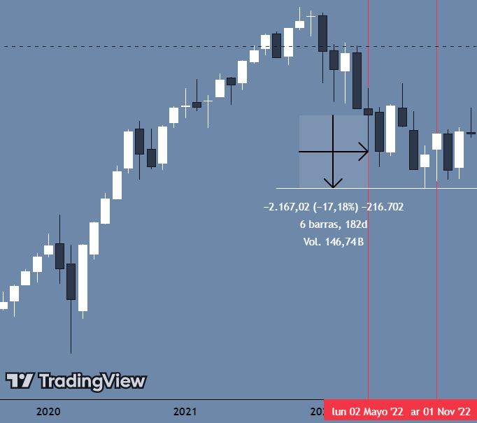

<br/>

###### **ADVANCED PROGRAMMING FOR DATA ANALYSIS**

###### Eugenio Lancha Gómez

<br/>

# MACROECONOMIA E.E.U.U & M2 LIQUIDITY

###### 

<br/>

### **Introducción**

<br/>

Este estudio se centra en el análisis exhaustivo de la economía estadounidense a través de dos conjuntos de datos fundamentales que abarcan diferentes períodos históricos. La combinación de estos datasets nos permitirá obtener una visión holística de la evolución económica de Estados Unidos, con especial énfasis en la relación entre los indicadores macroeconómicos tradicionales y la política monetaria.

El análisis se sustenta en la premisa de que la comprensión profunda de las interrelaciones entre variables macroeconómicas y monetarias es fundamental para entender los ciclos económicos, la efectividad de las políticas monetarias, y su impacto en el bienestar económico de la población. Este estudio cobra especial relevancia en el contexto actual, donde la política monetaria ha jugado un papel crucial en la estabilidad económica global.

<br/>

### **Descripción y Análisis de los Datasets**

<br/>

#### **1. Macroeconomía EEUU (USmacro_data)**

<br/>

Este conjunto de datos, obtenido a través de Kaggle (kaggle.com), proporciona una visión mensual detallada de la economía estadounidense desde noviembre de 1980. Con 499 registros y 8 variables clave, el dataset captura los principales indicadores macroeconómicos que definen el estado de la economía.

<br/>

##### Variables y su naturaleza:

<br/>

1.  **date** (Temporal)

    -   Tipo: Variable cuantitativa discreta

    -   Formato: YYYY-MM-DD

    -   Periodicidad: Mensual

    -   Rango: Desde noviembre 1980

    <br/>

2.  **CPI** (Índice de Precios al Consumidor)

    -   Tipo: Variable cuantitativa continua

    -   Unidad de medida: Índice base 100

    -   Relevancia: Indicador principal de inflación

    -   Rango observado: 85.6 - 291.5

    <br/>

3.  **Mortgage_rate** (Tasa Hipotecaria)

    -   Tipo: Variable cuantitativa continua

    -   Unidad de medida: Porcentaje (%)

    -   Rango observado: 2.684% - 18.454%

    -   Importancia: Indicador del costo del crédito hipotecario

    <br/>

4.  **Unemp_rate** (Tasa de Desempleo)

    -   Tipo: Variable cuantitativa continua

    -   Unidad de medida: Porcentaje (%)

    -   Rango observado: 3.500% - 14.700%

    -   Significado: Proporción de la población activa sin empleo

    <br/>

5.  **NASDAQ** (Índice Bursátil)

    -   Tipo: Variable cuantitativa continua

    -   Unidad de medida: Puntos

    -   Rango observado: 167.4 - 15,814.9

    -   Relevancia: Indicador del mercado de valores tecnológico

    <br/>

6.  **disposable_income** (Ingreso Disponible)

    -   Tipo: Variable cuantitativa continua

    -   Unidad de medida: Dólares estadounidenses

    -   Rango observado: 4,965 - 19,120

    -   Significado: Ingreso después de impuestos disponible para consumo o ahorro

        <br/>

7.  **Personal_consumption_expenditure** (Gasto en Consumo Personal)

    -   Tipo: Variable cuantitativa continua

    -   Unidad de medida: Dólares estadounidenses

    -   Rango observado: 1,827 - 16,955

    -   Importancia: Indicador del consumo privado

    <br/>

8.  **personal_savings** (Ahorros Personales)

    -   Tipo: Variable cuantitativa continua

    -   Unidad de medida: Porcentaje (%)

    -   Rango observado: 2.100% - 33.800%

    -   Significado: Proporción del ingreso destinado al ahorro

<br/>

```{r}
USmacro_data <- read.csv("US_macroeconomics.csv")
m2liquidity <- read.csv("m2_liquidity_data.csv")
head(USmacro_data)
```

```{r}
tail(USmacro_data)
```

<br/>

#### **2. M2 Liquidity (m2liquidity)**

<br/>

Este dataset, obtenido directamente de la Reserva Federal de St. Louis (FRED), proporciona información crucial sobre la oferta monetaria en Estados Unidos desde 1959. La medida M2 es particularmente importante para entender la política monetaria y sus efectos en la economía real.

##### Variables y su naturaleza:

<br/>

1.  **date** (Temporal)

    -   Tipo: Variable cuantitativa discreta

    -   Formato: YYYY-MM-DD

    -   Periodicidad: Mensual

    -   Rango: Desde enero 1959

    <br/>

2.  **value** (M2 Money Stock)

    -   Tipo: Variable cuantitativa continua

    -   Unidad de medida: Miles de millones de dólares estadounidenses

    -   Rango observado: 286.6 - 21,722.3

    -   Componentes detallados del M2:

        <br/>

        a)  **Efectivo en circulación**

        -   Billetes y monedas en manos del público

        -   Dinero físico utilizado en transacciones diarias

        -   Componente más líquido del M2

            <br/>

        b)  **Depósitos a la vista**

        -   Cuentas corrientes en bancos comerciales

        -   Fondos disponibles para retiro inmediato

        -   Utilizados principalmente para transacciones

        -   No generan intereses o generan intereses muy bajos

            <br/>

        c)  **Cuentas de ahorro**

        -   Depósitos que generan intereses

        -   Acceso relativamente fácil pero no inmediato

        -   Incluye cuentas de ahorro regulares y cuentas del mercado monetario

        -   Suelen tener límites en el número de retiros mensuales

            <br/>

        d)  **Depósitos a plazo menores a \$100,000**

        -   Certificados de depósito (CDs) pequeños

        -   Plazo fijo con penalización por retiro anticipado

        -   Mayores tasas de interés que las cuentas de ahorro

        -   Importantes para el ahorro a mediano plazo

            <br/>

        e)  **Fondos del mercado monetario minoristas**

        -   Inversiones en instrumentos de deuda a corto plazo

        -   Alta liquidez y bajo riesgo

        -   Rendimientos generalmente superiores a cuentas de ahorro tradicionales

        -   Utilizados como alternativa a las cuentas bancarias tradicionales

<br/>

```{r}
head(m2liquidity)
```

```{r}
tail(m2liquidity)
```

<br/>

Como se puede observar las primeras dos columnas de los datos de M2 no sirven de nada ya que solo muestran de forma repetida el dia en el que se descargaron los datos, asi que las eliminamos.

<br/>

```{r}
# Eliminar las dos primeras columnas de dataset1
m2liquidity <- m2liquidity[, -c(1, 2)]
head(m2liquidity)
```

<br/>

A continuación vamos a extraer un poco más de información a cerca de ambos dataset usando la función summary(), y el any(is.na()), para ver información de los datos de cada columna, y conocer los "na" en cada una de ellas, respectivamente.

<br/>

```{r}
# Verificación de valores faltantes
summary(USmacro_data)
any(is.na(USmacro_data))
```

```{r}
# Verificación de valores faltantes
summary(m2liquidity)
any(is.na(m2liquidity))
```

<br/>

Como podemos observar en ningún dataset encontramos ningún tipo de dato "na", lo que parece ser una muy buena señal.

Ahora, vamos a ver la estructura de los datos de cada dataset por si tuvieramos que realizar algun cambio.

<br/>

```{r}
str(USmacro_data)
str(m2liquidity)
```

<br/>

Parece que los datos de la columna "date" son son caracteres, "chr", por lo que vamos a cambiarlos por datos tipo "Date".

<br/>

```{r}
USmacro_data$date <- as.Date(USmacro_data$date)
m2liquidity$date <- as.Date(m2liquidity$date)

str(USmacro_data)
str(m2liquidity)
```

<br/>

Lo último que nos queda antes de comenzar a trabajar es juntar ambos datasets. Como ya hemos comentado, no tienen la misma longitud, por lo que utilizaremos la función "merge" para juntar ambos basandonos en las fechas comunes.

<br/>

```{r}
merged_data <- merge(USmacro_data, m2liquidity, by = "date")
head(merged_data)
```

```{r}
str(merged_data)
```

<br/>

#### **Análisis de Correlaciones y Potencial Analítico**

<br/>

**Introducción al Análisis de Correlaciones**

<br/>

Tras haber realizado una exhaustiva recopilación y procesamiento de datos macroeconómicos estadounidenses, podemos profundizar en el análisis de las relaciones entre las distintas variables estudiadas. La comprensión de estas interrelaciones es fundamental por varios motivos:

1.  Permite identificar **patrones** y **dependencias** entre variables macroeconómicas clave
2.  Facilita la comprensión de los mecanismos de transmisión de la política monetaria
3.  Ayuda a prever posibles impactos de cambios en determinadas variables sobre otras
4.  Proporciona una base sólida para la toma de decisiones en política económica

En esta sección, nos centraremos en el análisis de las correlaciones entre las variables estudiadas, utilizando técnicas estadísticas que nos permitirán cuantificar y visualizar estas relaciones. Este análisis no solo nos ayudará a entender mejor la estructura de la economía estadounidense, sino que también nos permitirá identificar áreas potenciales para investigación futura.

<br/>

**Metodología y Visualización**

<br/>

Para realizar este análisis, utilizaremos la **matriz de correlación** como herramienta principal. Esta matriz nos permite visualizar de manera clara y concisa las relaciones entre pares de variables, donde:

-   Los valores cercanos a 1 indican una fuerte correlación positiva
-   Los valores cercanos a -1 indican una fuerte correlación negativa
-   Los valores cercanos a 0 indican ausencia de correlación lineal

Este procedimiento no solo sirve para evidenciar la existencia de asociaciones estadísticamente relevantes, sino que también orientó la selección y futura comparación de aquellas variables que presentasen un vínculo potencialmente útil para explicar el comportamiento del NASDAQ.

<br/>

```{r}
# Cargar librería
library(corrplot)

# Seleccionar solo las columnas numéricas para la correlación
datos_numericos <- merged_data[, c("CPI", "Mortgage_rate", "Unemp_rate", "NASDAQ", 
                                 "disposable_income", "Personal_consumption_expenditure",
                                 "personal_savings", "value")]

# Renombrar columnas para mejor visualización
colnames(datos_numericos) <- c("CPI", "Tasa Hipot.", "Desempleo", "NASDAQ", 
                             "Ingreso Disp.", "Consumo", "Ahorro", "M2")

# Calcular matriz de correlación
matriz_correlacion <- cor(datos_numericos)

# Crear el gráfico
corrplot(matriz_correlacion,
         method = "color",      # Usar colores para visualizar
         addCoef.col = "black", # Mostrar coeficientes en negro
         number.cex = 0.7,      # Tamaño de los números
         tl.col = "black",      # Color del texto de etiquetas
         tl.srt = 45,          # Rotar texto 45 grados
         diag = FALSE) 
```

<br/>

**Análisis de las Correlaciones Observadas**

La matriz de correlación revela patrones significativos en las relaciones entre variables macroeconómicas:

<br/>

Una vez conocidas las correlaciones básicas, se procederá a un análisis detallado y exhaustivo de cada serie temporal de manera individual. Este estudio comprende:

<br/>

-   La evaluación de tendencias a largo plazo y posibles patrones de estacionalidad.

-   La identificación y discusión de acontecimientos históricos que pudiesen haber afectado significativamente a cada variable (p. ej., crisis económicas, cambios en la política monetaria de la Reserva Federal, contextos geopolíticos, entre otros).

-   La determinación de los períodos de mayor volatilidad y las causas subyacentes, con el fin de comprender cómo estas fluctuaciones pudieron repercutir en la población y, por ende, en los mercados financieros.

    <br/>

Estudiar cada variable de manera individual posibilitó la comprensión integral del contexto macroeconómico y monetario y delineó cómo cada componente podría incidir en el movimiento del índice bursátil.

<br/>

**1. Relaciones con la Oferta Monetaria (M2)**

\- El índice de precios al consumidor (CPI) de Estados Unidos tiene una fuerte correlación con la oferta monetaria (M2 liquidity) debido a la relación fundamental entre la cantidad de dinero en circulación y los niveles de precios en una economía.

\- La correlación con el NASDAQ sugiere una influencia significativa de la política monetaria en los mercados financieros

Esta relación puede explicarse desde varias perspectivas económicas:

<br/>

**Teoría cuantitativa del dinero**

𝑀𝑉=𝑃𝑄

donde:

-   M es la **oferta monetaria** (como M2)

-   V es la **velocidad del dinero** (la frecuencia con la que una unidad de moneda es utilizada para comprar bienes y servicios)

-   P es el **nivel de precios** (representado por el CPI)

-   Q es el producto real o la **producción económica**.

Si V y Q permanecen relativamente constantes, un aumento en M genera un aumento proporcional en P, es decir, en los precios. Esto implica que cuando se incrementa la cantidad de dinero en circulación (M2), eventualmente el nivel de precios tiende a subir, lo que se refleja en el CP

<br/>

**Efectos de la liquidez**

-   Cuando la oferta monetaria aumenta, los consumidores y empresas tienen más liquidez. Esto puede llevar a un aumento en la demanda de bienes y servicios.

-   Si la oferta de bienes y servicios no crece al mismo ritmo que la demanda, los precios tienden a subir, incrementando el CPI.

<br/>

```{r}
# Cargar librería
library(ggplot2)

# 1. Relaciones con la Oferta Monetaria (M2)
# Gráfico de M2
ggplot(merged_data, aes(x = date, y = value)) +
  geom_line(color = "blue") +
  labs(title = "Evolución de M2 a lo largo del tiempo",
       y = "M2 (Miles de millones USD)",
       x = "Año") +
  theme_minimal()
```

La oferta monetaria (M2) ha mostrado un crecimiento significativo a partir de 1980, con una aceleración notable después de 2008 y un crecimiento aún más pronunciado a partir de 2020.

La crisis financiera de 2008 llevó a una política monetaria expansiva, con la Reserva Federal (Fed) implementando programas de flexibilización cuantitativa (QE).

Durante la pandemia de COVID-19 en 2020, la Fed incrementó aún más la oferta monetaria para mitigar los efectos económicos de los confinamientos, lo que explica el pico reciente.

<br/>

-   **Descomposición de serie temporal:**

```{r}
# Convertir las fechas al formato adecuado en merged_data
merged_data$date <- as.Date(merged_data$date)

# Crear la serie temporal para M2
ts_data <- ts(merged_data$value, start = c(1980, 11), frequency = 12)

# Descomposición STL
decomposed <- stl(ts_data, s.window = "periodic")

# Graficar la descomposición
plot(decomposed, main = "Descomposición de la serie temporal M2")
```

**M2 Liquidity**

-   **Tendencia**: Muestra un aumento constante en la liquidez M2 desde 1980. Este crecimiento se acelera especialmente después del 2020, probablemente debido a políticas monetarias expansivas.

-   **Estacionalidad**: Exhibe un patrón cíclico claro, posiblemente relacionado con políticas monetarias regulares o factores económicos estacionales.

-   **Residuos**: Picos significativos alrededor del 2020, coincidiendo con la pandemia, lo que sugiere anomalías económicas.

<br/>

```{r}
# Gráfico de CPI
ggplot(merged_data, aes(x = date, y = CPI)) +
  geom_line(color = "red") +
  labs(title = "Evolución del CPI a lo largo del tiempo",
       y = "CPI",
       x = "Año") +
  theme_minimal()
```

El Índice de Precios al Consumidor (IPC) muestra un crecimiento constante con algunos picos ocasionales. A partir de 2020, se aprecia un incremento más acelerado.

La inflación reciente puede estar vinculada a los estímulos fiscales y monetarios masivos post-pandemia, junto con interrupciones en la cadena de suministro global.

Las tensiones geopolíticas (como la guerra en Ucrania) han afectado los precios de la energía y los alimentos, contribuyendo a la inflación.

<br/>

-   **Descomposición de serie temporal:**

```{r}
# Convertir las fechas al formato adecuado en merged_data
merged_data$date <- as.Date(merged_data$date)

# Crear la serie temporal para CPI
ts_data <- ts(merged_data$CPI, start = c(1980, 11), frequency = 12)

# Descomposición STL
decomposed <- stl(ts_data, s.window = "periodic")

# Graficar la descomposición
plot(decomposed, main = "Descomposición de la serie temporal CPI")
```

**CPI (Índice de Precios al Consumidor)**

-   **Tendencia**: La inflación muestra un aumento continuo desde 1980, con una aceleración más notable después del 2020.

-   **Estacionalidad**: Oscilaciones regulares, posiblemente reflejando aumentos de precios en ciertos períodos del año.

-   **Residuos**: Variabilidad significativa durante las crisis económicas de 2008 y 2020.

<br/>

```{r}
# Gráfico del NASDAQ
ggplot(merged_data, aes(x = date, y = NASDAQ)) +
  geom_line(color = "green") +
  labs(title = "Evolución del NASDAQ a lo largo del tiempo",
       y = "NASDAQ",
       x = "Año") +
  theme_minimal()
```

El índice NASDAQ ha mostrado un crecimiento espectacular desde 1980, con grandes burbujas en 2000 (burbuja tecnológica), 2008 y la más reciente en 2022.

La burbuja tecnológica de 2000 explotó debido a la sobrevaloración de empresas de tecnología.

Más recientemente, el auge de las tecnológicas durante la pandemia impulsó el NASDAQ, aunque también sufrió correcciones significativas en 2022 debido al endurecimiento de las políticas monetarias.

Esta es la relación, entre los mercados y la liquidez (M2 Liquidity), en políticas monetarias expansivas, la economía se sobre estimula de manera artificial provocando los conocidos "mercados alcistas", al igual que con las políticas restrictivas a traves de subidas de las tasas de interés, se enfria la economía de manera artificial.

<br/>

-   **Descomposición de serie temporal:**

```{r}
# Convertir las fechas al formato adecuado en merged_data
merged_data$date <- as.Date(merged_data$date)

# Crear la serie temporal para NASDAQ
ts_data <- ts(merged_data$NASDAQ, start = c(1980, 11), frequency = 12)

# Descomposición STL
decomposed <- stl(ts_data, s.window = "periodic")

# Graficar la descomposición
plot(decomposed, main = "Descomposición de la serie temporal NASDAQ")
```

**NASDAQ**

-   **Tendencia**: Presenta un fuerte crecimiento, especialmente a partir de la década de 2010, con una marcada aceleración post-2020.

-   **Estacionalidad**: Patrones estacionales menos evidentes, pero hay cierta repetición cíclica.

-   **Residuos**: Grandes picos alrededor del 2000 (burbuja tecnológica) y 2020 (pandemia), reflejando eventos excepcionales en el mercado.

<br/>

**2. Mercado Laboral y Consumo**

\- La tasa de desempleo muestra correlaciones negativas con el ingreso disponible y el consumo

\- Estas relaciones reflejan el impacto directo de las condiciones laborales en el bienestar económico

<br/>

```{r}
# 2. Mercado Laboral y Consumo
# Gráfico de Desempleo
ggplot(merged_data, aes(x = date, y = Unemp_rate)) +
  geom_line(color = "red") +
  labs(title = "Evolución de la Tasa de Desempleo",
       y = "Tasa de Desempleo (%)",
       x = "Año") +
  theme_minimal()

```

Muestra picos claros durante recesiones, especialmente en 2008 y 2020.

El desempleo se disparó durante la crisis financiera de 2008 y, más recientemente, debido a la pandemia de COVID-19.

Las rápidas medidas de estímulo, relacionadas con el aumento de la M2 liquidity, permitieron una recuperación más rápida del empleo tras la pandemia en comparación con crisis previas.

<br/>

-   **Descomposición de serie temporal:**

```{r}
# Convertir las fechas al formato adecuado en merged_data
merged_data$date <- as.Date(merged_data$date)

# Crear la serie temporal para Tasa de Desempleo
ts_data <- ts(merged_data$Unemp_rate, start = c(1980, 11), frequency = 12)

# Descomposición STL
decomposed <- stl(ts_data, s.window = "periodic")

# Graficar la descomposición
plot(decomposed, main = "Descomposición de la serie temporal Unemp_rate")
```

**Unemployment Rate**

-   **Tendencia**: Declive general en la tasa de desempleo, salvo repuntes claros durante las crisis (2008 y 2020).

-   **Estacionalidad**: Variaciones cíclicas anuales, probablemente reflejando fluctuaciones estacionales del mercado laboral.

-   **Residuos**: Grandes picos durante las crisis, reflejando un fuerte impacto externo.

<br/>

```{r}
# Gráfico de Ingreso Disponible
ggplot(merged_data, aes(x = date, y = disposable_income)) +
  geom_line(color = "blue") +
  labs(title = "Evolución del Ingreso Disponible",
       y = "Ingreso Disponible (USD)",
       x = "Año") +
  theme_minimal()
```

Crecimiento constante, con picos notables alrededor de 2020, explicado por los paquetes de estímulo directo a los hogares durante la pandemia explican los picos en ingreso disponible.

La recuperación de ingresos en 2021 se debió a la reapertura de la economía y la recuperación del empleo.

En esta gráfica podemos observar como grandes crisis como la burbuja de las punto com, la crisis financiera global de 2008, aparecen dejando picos, pero nada parecido a los de 2020. Esto nos indica que la inyección que se llevo acabo fue mucho mayor que en momentos anteriores.

<br/>

-   **Descomposición de serie temporal:**

```{r}
# Convertir las fechas al formato adecuado en merged_data
merged_data$date <- as.Date(merged_data$date)

# Crear la serie temporal para Ingreso Disponible
ts_data <- ts(merged_data$disposable_income, start = c(1980, 11), frequency = 12)

# Descomposición STL
decomposed <- stl(ts_data, s.window = "periodic")

# Graficar la descomposición
plot(decomposed, main = "Descomposición de la serie temporal Ingresio disponible")
```

**Ingreso Disponible**

-   **Tendencia**: Incremento sostenido, con una aceleración notable después del 2020.

-   **Estacionalidad**: Ciclos regulares que reflejan patrones estacionales de ingresos.

-   **Residuos**: Picos anómalos, especialmente durante los períodos de crisis económicas.

<br/>

**3. Dinámica del Consumo**

\- La fuerte correlación entre ingreso disponible y consumo personal confirma la teoría económica básica

\- El ahorro personal muestra patrones más complejos, sugiriendo la influencia de factores adicionales

<br/>

```{r}
# 3. Dinámica del Consumo
# Gráfico de Consumo Personal
ggplot(merged_data, aes(x = date, y = Personal_consumption_expenditure)) +
  geom_line(color = "purple") +
  labs(title = "Evolución del Consumo Personal",
       y = "Consumo Personal (USD)",
       x = "Año") +
  theme_minimal()
```

Crecimiento consistente con una caída breve durante la pandemia, seguida de una rápida recuperación.

El consumo personal es altamente sensible al ingreso disponible. La caída durante la pandemia refleja la incertidumbre y las restricciones, mientras que los estímulos gubernamentales ayudaron a reactivar el consumo rápidamente.

<br/>

-   **Descomposición de serie temporal:**

```{r}
# Convertir las fechas al formato adecuado en merged_data
merged_data$date <- as.Date(merged_data$date)

# Crear la serie temporal para Consumo Personal
ts_data <- ts(merged_data$Personal_consumption_expenditure, start = c(1980, 11), frequency = 12)

# Descomposición STL
decomposed <- stl(ts_data, s.window = "periodic")

# Graficar la descomposición
plot(decomposed, main = "Descomposición de la serie temporal Consumo Personal")
```

**Consumo Personal**

-   **Tendencia**: Crecimiento constante en el gasto de los consumidores.

-   **Estacionalidad**: Claros patrones cíclicos, probablemente relacionados con temporadas de alta demanda (como fin de año).

-   **Residuos**: Fluctuaciones alrededor del 2020, reflejando cambios en el consumo debido a la pandemia.

<br/>

```{r}
# Gráfico de Ahorro Personal
ggplot(merged_data, aes(x = date, y = personal_savings)) +
  geom_line(color = "orange") +
  labs(title = "Evolución del Ahorro Personal",
       y = "Tasa de Ahorro Personal (%)",
       x = "Año") +
  theme_minimal()
```

Oscila históricamente en torno al 5-10%, con un pico inusual durante 2020 y un retorno rápido a niveles previos.

Durante la pandemia, los hogares aumentaron sus tasas de ahorro debido a la incertidumbre y la reducción del gasto en bienes y servicios no esenciales. Posteriormente, al relajarse las restricciones, el ahorro cayó rápidamente con el repunte del consumo.

Se puede observar como desde 1980 hasta 2005/6, la tendencia del ahorro estaba descendiendo de forma calmada, tras la crisis de 2008, el ahorro de los hogares comienza a recuperar cotas perdidas hace decadas, y no de forma tan artificial como en 2020, colocandose entre el 5% y el 10%. Esto puede ser debido a un miedo generalizado entre los hogares despues de vivir una crisis reciente, y el instinto de estar preparado por si vuelve a pasar.

```{r}
# Convertir las fechas al formato adecuado en merged_data
merged_data$date <- as.Date(merged_data$date)

# Crear la serie temporal para Ahorro Personal
ts_data <- ts(merged_data$personal_savings, start = c(1980, 11), frequency = 12)

# Descomposición STL
decomposed <- stl(ts_data, s.window = "periodic")

# Graficar la descomposición
plot(decomposed, main = "Descomposición de la serie temporal Ahorro Personal")
```

**Ahorro Personal**

-   **Tendencia**: Generalmente estable, con un incremento abrupto alrededor de 2020, posiblemente debido a la reducción del gasto durante la pandemia.

-   **Estacionalidad**: Muestra patrones cíclicos regulares.

-   **Residuos**: Grandes picos durante eventos económicos extraordinarios, como 2020.

<br/>

#### **Comparación entre las variables**

<br/>

Con los resultados de la matriz de correlación y el análisis individual, se realizará una contrastación más profunda entre parejas de variables. Se seleccionaron aquellas con correlaciones de magnitud considerable y se abordó su explicación desde la perspectiva macroeconómica.

<br/>

```{r}
# Cargar las librerías necesarias
library(ggplot2)

# Gráfico de dispersion CPI vs. Mortgage_rate y linea de regresión
ggplot(merged_data, aes(x = CPI, y = Mortgage_rate)) +
  geom_point(alpha = 0.6, color = "blue") +
  geom_smooth(method = "lm", color = "red", se = FALSE) +
  labs(title = "CPI vs Mortgage_rate",
       x = "CPI (Inflación)",
       y = "Tasa de Hipoteca") +
  theme_minimal()
```

-   **Observación**:

1.  La relación es claramente **negativa**, como era de esperar. A medida que el CPI aumenta, la tasa de hipoteca tiende a disminuir. Esto sugiere que en períodos de alta inflación, las tasas hipotecarias han bajado, posiblemente debido a políticas monetarias expansivas.

2.  **Curvatura al final**: En los valores más altos de CPI (posteriores), la tasa hipotecaria parece comenzar a estabilizarse o incluso subir ligeramente. Esto podría indicar un cambio en la política monetaria reciente.

<br/>

```{r}
# Gráfico de dispersion M2 vs. Mortgage_rate y linea de regresión
ggplot(merged_data, aes(x = value, y = Mortgage_rate)) +
  geom_point(alpha = 0.6, color = "purple") +
  geom_smooth(method = "lm", color = "red", se = FALSE) +
  labs(title = "M2 Liquidity vs Mortgage_rate",
       x = "M2 Liquidity",
       y = "Tasa de Hipoteca") +
  theme_minimal()
```

-   **Observación**:

    Existe una **relación negativa**: mayor liquidez en la economía (M2) está asociada con tasas hipotecarias más bajas. Esto es consistente con períodos de política monetaria expansiva donde se inyecta más dinero para reducir las tasas.

<br/>

```{r}
# Gráfico de dispersion M2 vs. CPI y linea de regresión
ggplot(merged_data, aes(x = value, y = CPI)) +
  geom_point(alpha = 0.6, color = "brown") +
  geom_smooth(method = "lm", color = "red", se = FALSE) +
  labs(title = "M2 Liquidity vs CPI",
       x = "M2 Liquidity",
       y = "CPI (Inflación)") +
  theme_minimal()
```

-   **Observación**:

    Relación **positiva fuerte**. A medida que la liquidez aumenta, el CPI también lo hace, es por esto que despues de politicas monetarias expansivas vivimos aumentos de precio (inflación)

<br/>

**Regresiones Multivariadas**

<br/>

**¿Qué es?**: Es un modelo estadístico que permite analizar el impacto de **múltiples variables independientes (predictoras)** sobre una **variable dependiente**. A diferencia de la regresión simple, aquí puedes estudiar cómo **varias variables juntas** explican los cambios en la variable objetivo.

**¿Por qué podría ser útil?**:

-   Podriamos analizar cómo **CPI**, **M2**, y **Mortgage_rate** afectan simultáneamente al **NASDAQ**.

-   Nos permitiría ver qué variable tiene un impacto más fuerte sobre la variables dependiente, controlando por las demás.

-   También puede ayudarte a **aislar efectos**: por ejemplo, determinar si la relación entre **CPI y Mortgage_rate** sigue siendo significativa después de controlar por **M2 Liquidity**.

```{r}
# Modelo de regresión múltiple para NASDAQ
modelo_nasdaq <- lm(NASDAQ ~ CPI + value + Mortgage_rate + Unemp_rate, data = merged_data)

# Resumen del modelo
summary(modelo_nasdaq)
```

-   **Intercept**:

El valor base del **NASDAQ** es **3865.95** cuando todas las variables independientes son iguales a cero. Aunque este valor tiene un significado limitado en este contexto, es útil para la interpretación global.

<br/>

-   **CPI (Índice de Precios al Consumidor)**:

**Coeficiente**: -32.94

**Interpretación**: Por cada unidad adicional en el **CPI**, el **NASDAQ** tiende a reducirse en 32.94 puntos, manteniendo constantes las demás variables.

**Significancia**: Es altamente significativo (**p \< 2e-16**), lo que sugiere que la inflación tiene un impacto importante y negativo en el desempeño del mercado.

<br/>

-   **Value (M2 Liquidity)**:

**Coeficiente**: 0.93

**Interpretación**: Por cada unidad de aumento en **value**, el **NASDAQ** aumenta en 0.93 puntos.

**Significancia**: Altamente significativa (**p \< 2e-16**). Esto indica una relación positiva robusta entre esta variable y el mercado.

<br/>

-   **Mortgage_rate (Tasa de Hipoteca)**:

**Coeficiente**: 7.41

**Interpretación**: Un aumento en la tasa de hipoteca incrementa ligeramente el índice NASDAQ en 7.41 puntos.

**Significancia**: No significativa (**p = 0.791**). La tasa de hipoteca no parece tener un impacto importante directo sobre el NASDAQ en este modelo.

<br/>

-   **Unemp_rate (Tasa de Desempleo)**:

**Coeficiente**: -281.45

**Interpretación**: Por cada unidad adicional en la **tasa de desempleo**, el **NASDAQ** disminuye en 281.45 puntos.

**Significancia**: Altamente significativa (**p \< 2e-16**). Esto sugiere que el desempleo es un factor clave y negativo para el mercado bursátil.

<br/>

-   **R² (R-cuadrado)**: 0.9448

    El modelo explica el **94.48%** de la variabilidad en el índice NASDAQ, lo que indica un excelente ajuste.

-   **F-Statistic** (Evalúa si al menos una de las variables independientes tiene un efecto significativo en la variable dependiente): 2115 (p \< 2.2e-16)

    El modelo global es altamente significativo.

-   **Errores residuales**:

    Los residuos tienen un rango bastante amplio (-1885.8 a 3260.3), pero la **desviación estándar residual** de **741.2** es razonable dado el rango de valores del NASDAQ.

<br/>

**Conclusiones**:

-   **CPI** y **Unemployment_rate** son las variables que más negativamente afectan al índice NASDAQ.

-   **Value** tiene un efecto positivo significativo.

-   **Mortgage_rate** no muestra un impacto relevante en este análisis.

<br/>

<br/>

La intervención agresiva de la Fed y del gobierno de EE.UU. en momentos de crisis ha tenido efectos visibles en la economía, desde los mercados financieros como el NASDAQ, hasta el ahorro del individuo, pasando por el consumo personal.

Las gráficas destacan cómo el aumento de M2 ha tenido un impacto en la inflación, ya que como observamos el aumento de la m2 liquidity en la crisis de 2020 fue mucho mayor que en 2008, provocando un aumento exorbitado de la liquidez con el objetivo de evitar una crisis mayor, aceptando así un aumento de la inflación durante un breve periodo de tiempo.

<br/>

#### **Continuidad del Proyecto hacia Modelos Predictivos**

<br/>

Este análisis ha evidenciado la estrecha relación entre los indicadores macroeconómicos y el comportamiento del mercado financiero en Estados Unidos. En particular, la correlación entre la masa monetaria M2 y el índice de precios al consumidor (CPI) destaca cómo las políticas monetarias influyen en la inflación. A su vez, la relación entre el CPI y el índice NASDAQ refuerza la idea de que los cambios en el poder adquisitivo afectan significativamente las dinámicas del mercado bursátil.

La observación de tendencias a través de series temporales también reveló cómo crisis económicas específicas, como la recesión de 2008, impactaron de manera significativa tanto en el mercado financiero como en indicadores económicos clave, subrayando la relación entre estas variables.

<br/>

Para avanzar en este análisis, la siguiente fase se centrará en el desarrollo de modelos predictivos. El objetivo principal será predecir el índice NASDAQ utilizando variables macroeconómicas como el CPI, M2, y otras que puedan ser relevantes.

**Objetivos de la Fase Predictiva**

Predecir el comportamiento del índice NASDAQ: Comprender mejor cómo factores como la liquidez M2 y la inflación afectan a los mercados financieros.

Explorar otras variables predictivas: Identificar variables macroeconómicas que sean útiles para anticipar tendencias económicas, como las tasas de desempleo o los ingresos disponibles.

<br/>

**Metodologías Propuestas Modelos Estadísticos:**

-   **ARIMA**: Ideal para capturar patrones temporales en series univariadas como el CPI o el NASDAQ.

-   **VAR**: Útil para explorar relaciones entre múltiples series temporales, como la interacción entre M2, CPI, y NASDAQ.

<br/>

**Modelos de Machine Learning:**

-   **Regresión Lineal Múltiple**: Para evaluar la relación entre múltiples variables predictoras y un objetivo.

-   **Redes Neuronales (RNN, LSTM)**: Diseñadas para capturar patrones no lineales y dependencias temporales complejas, mejorando la capacidad de predicción en datos secuenciales.

<br/>

Finalmente, con la idea de materializar el objetivo último del estudio —la predicción del NASDAQ— se evaluaron diversas metodologías, valorando tanto las fortalezas como las limitaciones en función de la cantidad, el tipo de datos disponibles, la estructura temporal de las variables, etc.

Tras revisar diversas alternativas, el modelo **ARIMAX** (Autoregressive Integrated Moving Average with Exogenous Variables) fue elegido como la estrategia más adecuada para esta investigación, tanto por la periodicidad de los datos en los dataset, como el tamaño de los mismos. Este modelo combina la capacidad de capturar componentes autorregresivos y de medias móviles, al tiempo que permite incorporar variables exógenas que, como se ha demostrado en el análisis preliminar, ejercen una influencia notable en el índice bursátil.

Para tener en cuenta en el modelo estas variables exógenas hemos tenido que crear una matriz con los valores de estas desde el punto donde se realiza la prediccion (Mayo 2022) hasta el final, unos seis meses despues. Estos datos han sido recogidos de la pagina Datosmacro.com.

<br/>

```{r}
library(forecast)

# 1. Crear la serie temporal principal
nasdaq_ts <- ts(merged_data$NASDAQ, 
               start = c(1980, 11), 
               frequency = 12)

# 2. Crear la matriz de variables exógenas
exog_vars <- cbind(
 CPI          = merged_data$CPI,
 Unemp_rate   = merged_data$Unemp_rate,
 Mortgage_rate= merged_data$Mortgage_rate
)

# 3. Ajustar el modelo ARIMAX
model_arimax <- auto.arima(
 nasdaq_ts, 
 xreg = exog_vars,
 stepwise = FALSE, 
 approximation = FALSE
)

# 4. Resumen del modelo
summary(model_arimax)

# 5. Crear matriz de valores futuros para variables exógenas (6 meses desde mayo 2022)
future_xreg <- matrix(
c(
  # CPI futuros (junio 2022 a mayo 2023)
  c(296.311, 297.789, 296.171, 296.808, 298.012, 299.607),
  # Unemployment rate futuros (junio 2022 a mayo 2023)
  c(3.6, 3.5, 3.6, 3.5, 3.6, 3.6),
  # Mortgage rate futuros (junio 2022 a mayo 2023)
  c(5.5, 5.4, 5.2, 6.0, 6.9, 6.8)
),

 ncol = 3,
 dimnames = list(NULL, colnames(exog_vars))
)

# 6. Predicción a futuro
forecasts_arimax <- forecast(model_arimax, xreg = future_xreg, h = 6)

# 7. Visualización mejorada
plot(forecasts_arimax, 
    xlim = c(2020, 2023),
    main = "Predicción ARIMAX NASDAQ",
    ylab = "Índice NASDAQ",
    xlab = "Año",
    col = "blue",
    fcol = "red",
    shadecols = c("#CCCCCC"))

# Añadir leyenda
legend("topleft", 
      legend = c("Histórico", "Predicción", "Intervalo de confianza"),
      col = c("blue", "red", "grey"),
      lty = c(1, 1, 1),
      cex = 0.8)
```

<br/>

-   El **MAPE** mide el error promedio relativo entre los valores observados y predichos, expresado como un porcentaje.

    Un MAPE de 4.02% significa que, en promedio, las predicciones del modelo se desvían un 4.02% de los valores reales, lo cual es considerado un error bajo y aceptable en análisis de series temporales.

-   El **ME** representa el error promedio, sin importar su signo, y mide si el modelo tiene un sesgo en sus predicciones.

    El ME cercano a cero (2.52) sugiere que el modelo no tiene un sesgo significativo en las predicciones, es decir, no sobreestima ni subestima sistemáticamente los valores del índice.

-   El **RMSE** mide la magnitud promedio del error en términos absolutos, penalizando más los errores grandes.

    Aunque el valor es alto (198.89), esto se debe a la naturaleza volátil del índice NASDAQ y a los valores elevados que maneja (superiores a 10,000 puntos).

-   **ACF1**. La autocorrelación residual mide si los errores del modelo están correlacionados entre sí, lo cual puede indicar un problema en el ajuste.

    Un ACF1 cercano a cero indica que el modelo ha capturado correctamente las relaciones temporales de la serie, y los residuos no tienen dependencias significativas.

-   El **CPI** mide la variación en los precios de bienes y servicios, un indicador clave de la inflación. El coeficiente positivo (23.45) indica que un aumento en el CPI está relacionado con un incremento en el índice NASDAQ, posiblemente debido a mayores expectativas de beneficios corporativos en un contexto inflacionario.

-   El coeficiente negativo (-39.10) sugiere que un aumento en las **tasas hipotecarias** reduce el índice NASDAQ, posiblemente debido al impacto negativo de tasas altas en el consumo y la inversión. Sin embargo, su alto error estándar (39.89) indica que su influencia puede variar considerablemente.

-   **Sigma².** La varianza residual mide la dispersión de los errores del modelo (refleja que tan dispersos estan los valores predichos de los reales observados).

    Un valor elevado (40287) refleja que los errores son significativos en términos absolutos, lo que podría deberse a factores no capturados por el modelo, como eventos económicos no previstos.

<br/>

\


<br/>

Como podemos observar, el NASDAQ continuo con su caida, un 17,18% más, pero la aceleración con la que bajaba fue disminuyendo hasta aplanarse casi por completo, al igual que nos muestra nuestro modelo.

<br/>

```{r}
# Análisis de residuos
checkresiduals(model_arimax)
```

<br/>

-   **Gráfico de residuos:**

    -   Representa los errores del modelo a lo largo del tiempo.

    -   **¿Qué indica?** Los residuos parecen estar centrados alrededor de cero, lo que es deseable, pero hay algunos picos grandes sobre todo en los ultimos años que podrían reflejar eventos inusuales o puntos extremos no capturados por el modelo. En general, el comportamiento es aceptable para un modelo de series temporales.

-   **ACF de residuos :**

    -   **¿Qué es?** Muestra la autocorrelación de los residuos a distintos retrasos (lags).

    -   **¿Qué indica?** Aunque la mayoría de las barras están dentro del intervalo de confianza (líneas azules), hay algunos valores significativos en ciertos retrasos. Esto sugiere que no toda la dependencia temporal ha sido completamente eliminada, lo que podría indicar margen de mejora en el modelo.

-   **Histograma de residuos :**

    -   **¿Qué es?** Muestra la distribución de los errores del modelo.

    -   **¿Qué indica?** La distribución tiene una forma aproximadamente simétrica y centrada en cero, pero con una alta concentración, lo que indica la presencia de algunos errores extremos. Esto podría reflejar limitaciones en el modelo para capturar movimientos bruscos del mercado.

-   **Prueba Ljung-Box** (herramienta estadistica de analisis de residuos comunmente utilizada importante para evaluar la calidad del modelo de regresión)

    -   **¿Qué es?** Evalúa si hay autocorrelación significativa en los residuos hasta un número específico de retrasos (permiten evaluar si los residuos estan correlacionados con sus propios valores pasados). La autocorrelación en los residuos indica que el modelo no ha capturado completamente la estructura de dependencia temporal presente en los datos.

    -   **¿Qué indica?** El p-value es muy bajo (**0.0002823**), lo que lleva a rechazar la hipótesis nula de que no hay autocorrelación en los residuos. Esto significa que el modelo no ha capturado completamente toda la estructura de dependencia temporal en los datos, lo que podría afectar la calidad de las predicciones.

-   **Grados de libertad :**

    -   **¿Qué es?** Indica el número de retrasos considerados en la prueba Ljung-Box.

    -   **¿Qué indica?** Con 19 grados de libertad, la prueba evalúa una cantidad razonable de dependencia en el tiempo. Sin embargo, los residuos muestran que aún queda autocorrelación no explicada.

El modelo ARIMAX muestra un desempeño aceptable para capturar las tendencias generales del índice NASDAQ, con errores moderados y residuos centrados en cero.

Sin embargo, la presencia de autocorrelación en los residuos, confirmada por la prueba Ljung-Box, indica que no toda la dependencia temporal ha sido eliminada, lo que limita su capacidad para prever movimientos extremos del mercado. A pesar de ser útil para análisis generales, el modelo podría beneficiarse de ajustes adicionales en su estructura o la incorporación de más variables explicativas para mejorar su precisión y robustez.
